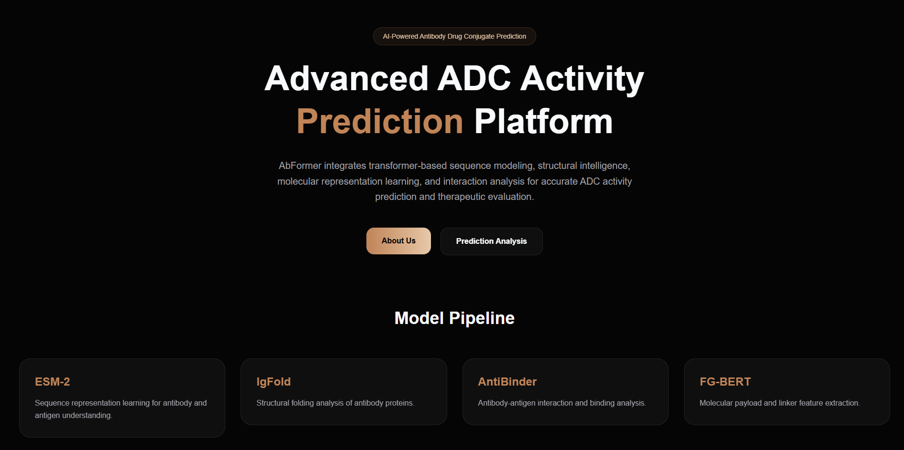
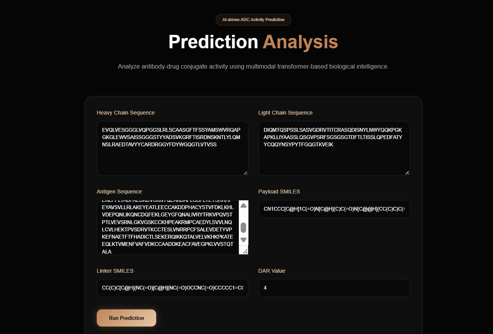
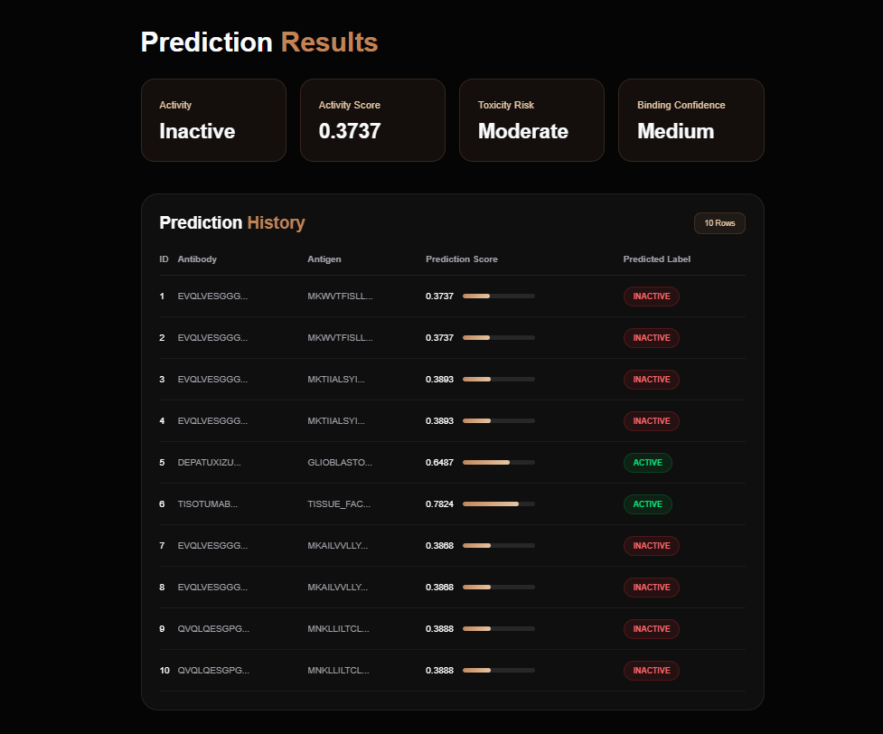
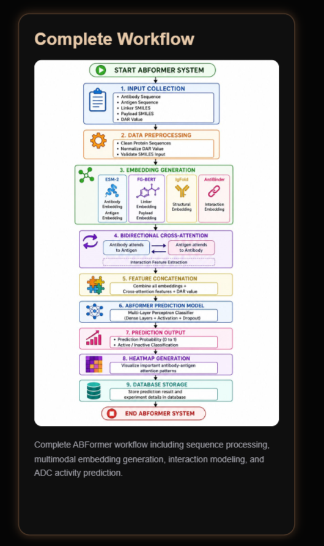
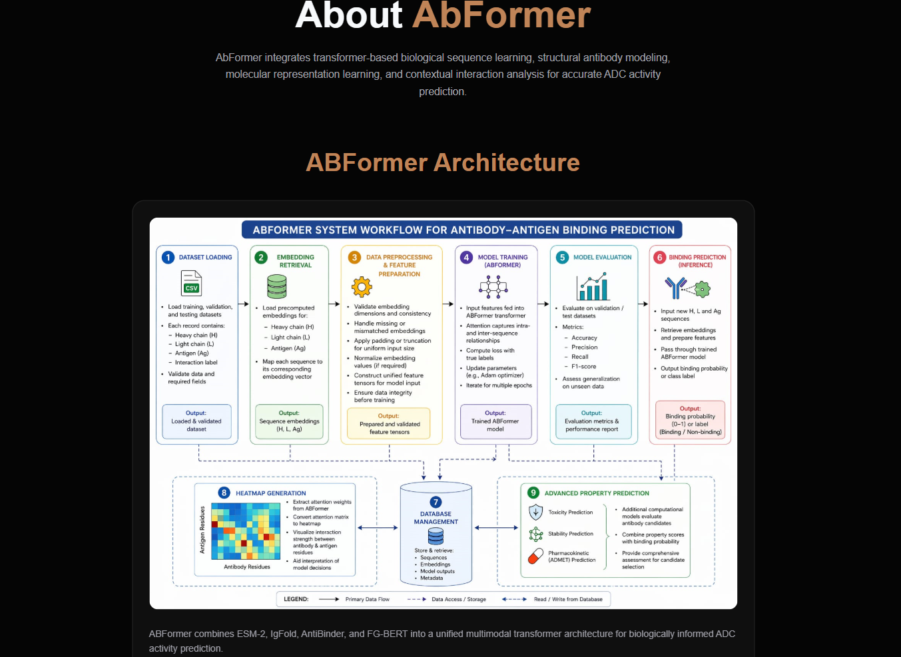

<div align="center">

# 🧬 ABFormer

### Multimodal Deep Learning Framework for Antibody–Drug Conjugate (ADC) Prediction

A web-based deep learning framework that integrates protein language models, structural embeddings, and molecular descriptors to predict ADC binding performance.


</div>

---

# 📖 Overview

Antibody–Drug Conjugates (ADCs) are targeted cancer therapies that combine monoclonal antibodies with cytotoxic drugs to selectively attack cancer cells.

**ABFormer** is a multimodal deep learning framework that combines biological and chemical information to predict ADC binding performance through an interactive web application.

The framework integrates multiple data modalities, including:

- Antibody sequence embeddings
- Antigen sequence embeddings
- Structural representations
- Amino Acid Composition (AAC)
- MACCS molecular fingerprints
- Drug-to-Antibody Ratio (DAR)

These features are fused using transformer-based attention mechanisms to improve prediction performance.

---

# ✨ Features

- Web-based ADC prediction interface
- FastAPI backend for inference
- React + Vite frontend
- Transformer-based multimodal feature fusion
- Prediction history
- Heatmap visualization
- Interactive user interface

---

# 🏗️ Project Structure

```text
ABFormer/
│
├── backend/
│   ├── AntiBinder/
│   ├── Ablation/
│   ├── Embeddings/
│   ├── ckpts/
│   ├── data/
│   ├── routes/
│   ├── app.py
│   ├── inference.py
│   ├── model.py
│   ├── train.py
│   └── README.md
│
├── frontend/
│   ├── public/
│   ├── src/
│   ├── package.json
│   ├── vite.config.js
│   └── README.md
│
├── .gitignore
└── README.md
```

---

# ⚙️ Technology Stack

## Backend

- Python
- FastAPI
- PyTorch
- NumPy
- Pandas
- SQLite

## Frontend

- React
- Vite
- JavaScript
- CSS

## Deep Learning

- ESM-2
- IgFold
- FG-BERT
- AntiBinder
- Cross Attention Networks
- Transformer Architecture

---

# 🔬 Model Workflow

```text
User Input
    │
    ▼
Heavy Chain
Light Chain
Antigen Sequence
Payload SMILES
Linker SMILES
Drug-to-Antibody Ratio (DAR)
    │
    ▼
Feature Extraction
    │
    ├── Protein Language Embeddings (ESM-2)
    ├── Structural Embeddings (IgFold)
    ├── Amino Acid Composition (AAC)
    ├── MACCS Fingerprints
    └── Chemical Features
    │
    ▼
Multimodal Feature Fusion
    │
    ▼
ABFormer Prediction Model
    │
    ▼
Binding Prediction
    │
    ▼
Prediction Score + Heatmap
```

---

# 🚀 Getting Started

## Clone the Repository

```bash
git clone https://github.com/Thanushri25/ABFormer.git
cd ABFormer
```

---

## Backend Setup

```bash
cd backend

conda env create -f ABFormer_env.yml

conda activate ABFormer

python -m uvicorn app:app --reload
```

Backend will run at:

```
http://127.0.0.1:8000
```

---

## Frontend Setup

```bash
cd frontend

npm install

npm run dev
```

Frontend will run at:

```
http://localhost:5173
```

---

# 📝 Input Parameters

The prediction interface accepts:

- Heavy Chain Sequence
- Light Chain Sequence
- Antigen Sequence
- Payload SMILES
- Linker SMILES
- Drug-to-Antibody Ratio (DAR)

---

# 📊 Output

The application provides:

- Predicted ADC Score
- Prediction Confidence
- Attention Heatmap
- Prediction History

---

# 📷 Application Screenshots

> Add your screenshots inside **docs/images/** and update the filenames below.

## Home Page



---

## Prediction Page



---

## Results



---

## Workflow



---

## Model Architecture



---

# 📂 Repository

| Folder                | Description                                              |
| --------------------- | -------------------------------------------------------- |
| `backend/`            | FastAPI backend, model inference, APIs, training scripts |
| `frontend/`           | React web application                                    |
| `backend/Embeddings/` | Precomputed embedding files                              |
| `backend/routes/`     | API endpoints                                            |
| `backend/data/`       | Dataset files                                            |

---

# 🔮 Future Improvements

- Docker containerization
- Cloud deployment
- User authentication
- Batch inference support
- Explainable AI visualizations
- Automated model retraining

---

# 👥 Authors

Developed as part of an academic project on **multimodal deep learning for Antibody–Drug Conjugate (ADC) prediction**.

---

# 📄 License

This project is intended for academic and research purposes.
