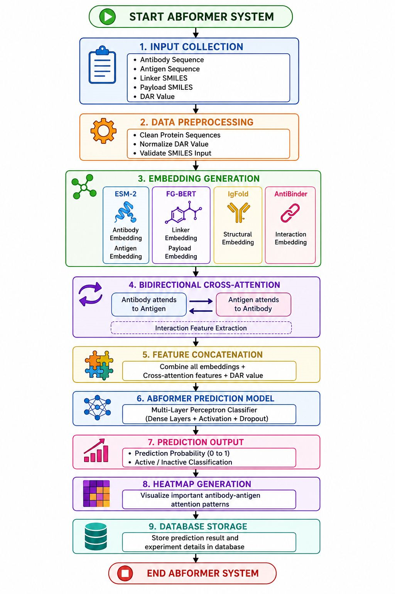
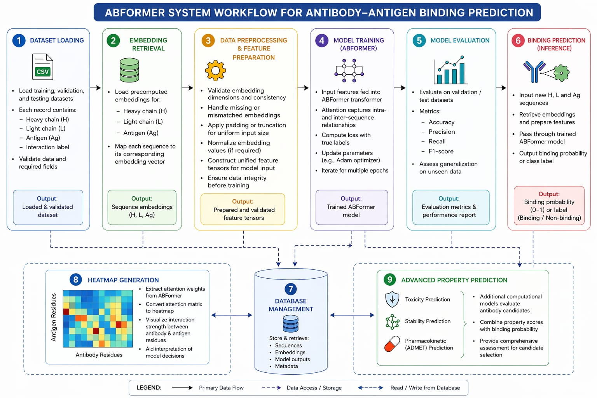
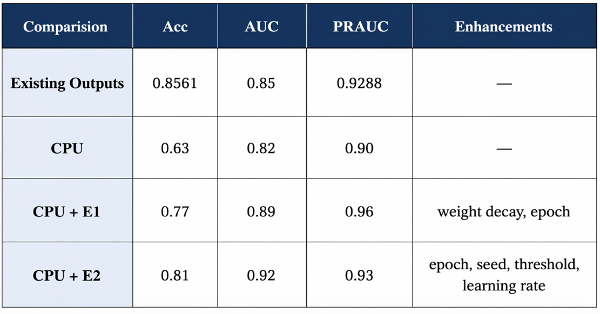

<div align="center">

# 🧬 ABFormer

### Multimodal Deep Learning Framework for Antibody-Drug Conjugate (ADC) Prediction

AI-powered framework that combines protein language models, structural embeddings, and molecular descriptors to predict Antibody-Drug Conjugate performance.


</div>

---

# Overview

ABFormer is a multimodal Artificial Intelligence framework developed for predicting the binding performance of Antibody-Drug Conjugates (ADCs).

Instead of relying on a single data source, ABFormer combines

- Protein sequence embeddings
- Protein structural embeddings
- Molecular fingerprints
- Amino Acid Composition (AAC)
- MACCS fingerprints
- Drug-to-Antibody Ratio (DAR)

using transformer-based attention mechanisms.

The system provides an intuitive web interface that allows users to submit antibody and antigen sequences together with payload information and obtain prediction results.

---

# Features

- AI-powered ADC prediction
- Transformer-based multimodal fusion
- FastAPI backend
- React + Vite frontend
- Prediction history
- Heatmap visualization
- Interactive web interface
- Research-oriented architecture

---

# Tech Stack

## Backend

- Python
- FastAPI
- PyTorch
- NumPy
- Pandas
- SQLite

## Frontend

- React
- Vite
- JavaScript
- CSS

## Deep Learning

- ESM-2
- IgFold
- AntiBinder
- FG-BERT
- Cross Attention
- Transformer Networks

---

# Project Structure

```text
ABFormer
│
├── backend
│   ├── app.py
│   ├── inference.py
│   ├── train.py
│   ├── model.py
│   ├── routes
│   ├── AntiBinder
│   ├── Embeddings
│   ├── data
│   └── README.md
│
├── frontend
│   ├── src
│   ├── public
│   ├── package.json
│   └── README.md
│
├── README.md
└── .gitignore
```

---

# Model Workflow

```text
User Input
      │
      ▼
Heavy Chain
Light Chain
Antigen Sequence
Payload
Linker
DAR
      │
      ▼
Feature Extraction
      │
      ├── ESM-2 Embeddings
      ├── IgFold Structure
      ├── AAC Features
      ├── MACCS Fingerprints
      └── Chemical Embeddings
      │
      ▼
ABFormer Multimodal Fusion
      │
      ▼
Prediction Layer
      │
      ▼
ADC Binding Prediction
```

---

# Running the Project

## Clone Repository

```bash
git clone https://github.com/Thanushri25/ABFormer.git
cd ABFormer
```

---

## Backend

```bash
cd backend

conda env create -f ABFormer_env.yml

conda activate ABFormer

python -m uvicorn app:app --reload
```

Backend

```
http://127.0.0.1:8000
```

---

## Frontend

```bash
cd frontend

npm install

npm run dev
```

Frontend

```
http://localhost:5173
```

---

# Input

The prediction API accepts

- Heavy Chain Sequence
- Light Chain Sequence
- Antigen Sequence
- Payload SMILES
- Linker SMILES
- Drug-to-Antibody Ratio (DAR)

---

# Output

The system generates

- Predicted ADC Score
- Confidence Score
- Heatmap Visualization
- Prediction History

---

# Architecture

Replace these placeholders with your images.

```markdown





```

---

# Future Improvements

- Docker support
- Cloud deployment
- Batch inference
- Explainable AI
- User authentication
- Model retraining pipeline

---

# Repository

```
backend/
```

Contains all AI models, APIs and inference pipeline.

```
frontend/
```

Contains the React web application.

---

# Acknowledgements

This project was developed as part of an academic research initiative focused on multimodal deep learning for Antibody-Drug Conjugate prediction.
